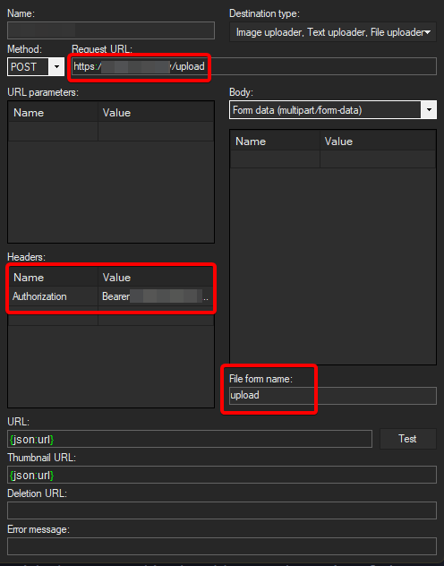

A blazing fast minimal ShareX backend written in Go. Echo-Vault keeps the moving parts lean: it stores uploads, exposes a tiny API, and lets a reverse proxy handle the heavy lifting. Images are converted to WebP by default for small file sizes and quick delivery, with optional GIF re-encoding to scrub metadata.

## Features

- Drop-in ShareX uploader with bearer-token auth
- Automatic WebP conversion with configurable quality/effort
- Optional GIF re-encoding (or keep original GIFs intact)
- Import existing files straight into the database
- Commented `config.yml` generated on first run

## Installation

1. Download the [latest release](https://github.com/coalaura/echo-vault/releases/latest) or build from source.
2. Run the binary once in the target directory to create `config.yml` and the `storage/` folder.
3. Edit `config.yml` to match your domain, port, and upload token.
4. (Optional) Install the provided [echo_vault.service](echo_vault.service) unit next to the binary.
5. Make the binary executable: `chmod +x echo_vault`.
6. Update the service file paths, symlink it into `/etc/systemd/system/`, and start it (`service echo_vault start`).
7. Point nginx (or another reverse proxy) at the backend (config below).
8. Configure ShareX to send uploads to your instance using the bearer token.



## Configuration

Running Echo-Vault creates a commented `config.yml` beside the binary. Adjust it and restart the service.

```yaml
server:
  # base url of your instance (default: http://localhost:8080)
  url: http://localhost:8080

  # port to run echo-vault on (default: 8080)
  port: 8080

  # upload token for authentication, leave empty to disable auth (default: p4$$w0rd)
  token: p4$$w0rd

  # maximum upload file-size in MB (default: 10MB)
  max_file_size: 10

settings:
  # quality/speed trade-off (0 = fast, 6 = slower-better; default: 4)
  effort: 4

  # webp quality (0-100, 100 = lossless; default: 90)
  quality: 90

  # re-encode gif uploads to strip metadata (default: true)
  re_encode_gif: true
```

### `server` section

| Key | Type | Default | Description |
|-----|------|---------|-------------|
| `url` | string | `http://localhost:8080` | Public base URL used when generating response links. |
| `port` | int | `8080` | Port Echo-Vault listens on. |
| `token` | string | `p4$$w0rd` | Bearer token required for uploads and management endpoints. Leave empty to disable auth (not recommended). |
| `max_file_size` | int | `10` | Reject uploads larger than this limit in MB. |

### `settings` section

| Key | Type | Default | Description |
|-----|------|---------|-------------|
| `effort` | int (0-6) | `4` | WebP encoder speed/quality trade-off (`6` squeezes the best compression). |
| `quality` | int (0-100) | `90` | WebP quality; `100` switches to lossless mode automatically. |
| `re_encode_gif` | bool | `true` | Re-save GIFs to strip metadata (set `false` to keep originals). |

Echo-Vault stores files inside the `storage/` directory (created automatically). You can symlink this folder if you prefer a different location.

## API

Serve static files directly through nginx-Echo-Vault also exposes `/{hash}.{ext}` (`ext` = `webp` or `gif`) for completeness, but letting nginx handle static files is faster. Keep the proxy routing limited to uploads and database-backed endpoints:

```nginx
location / {
    root /path/to/your/storage;

    # Fix for old versions not using webp
    if ($request_uri ~* ^(.+)\.(jpg|png)$) {
        set $webp_uri $1.webp;

        return 301 $webp_uri;
    }

    expires 30d;
}

location ~ ^/(upload|echos) {
    proxy_pass       http://localhost:8080;
    proxy_set_header X-Forwarded-For $proxy_add_x_forwarded_for;
    proxy_set_header Host            $host;
}
```

### Authentication

All API routes under `/upload` and `/echos` expect `Authorization: Bearer <token>` unless `token` is empty.

### `POST /upload`

Upload an image via multipart form (`upload=<file>`). Supported types: JPEG, PNG, GIF, WebP. Responses include the canonical hash, stored extension, URL, and formatted size:

```json
{
    "hash": "AXHN6RKPCT",
    "extension": "webp",
    "url": "https://example.com/AXHN6RKPCT.webp",
    "size": "842.3 kB"
}
```

### `GET /echos/{page}`

Returns up to 15 uploads per page (1-indexed). Example response:

```json
[
    {
        "id": 8,
        "hash": "3ZFPMNRGFJ",
        "name": "2023-11-24 00_04_28.png",
        "extension": "webp",
        "upload_size": 4818389,
        "timestamp": 1701110029
    }
]
```

### `DELETE /echos/{hash}`

Removes both the file and its database entry. A successful deletion replies with `200 OK` and an empty body.

## CLI

Echo-Vault doubles as a tiny maintenance tool when invoked with commands:

### `echo-vault scan`

Walks the `storage/` directory and imports missing files into the database. Progress is logged to stdout.
