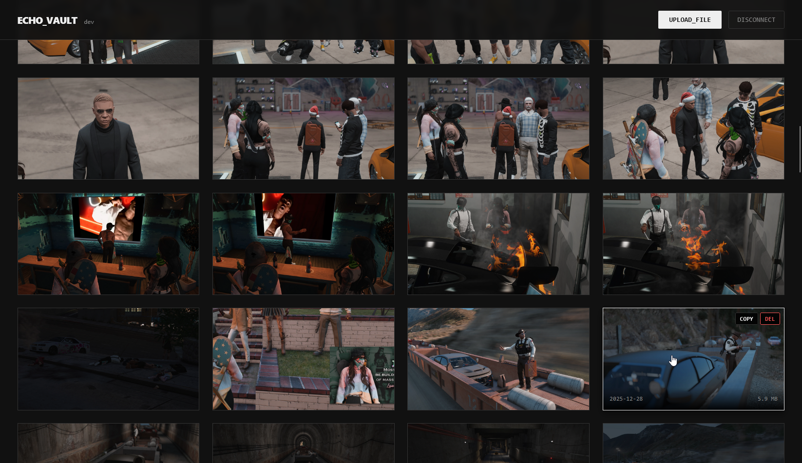

A blazing fast, minimal ShareX backend written in Go. Echo-Vault features a powerful, configurable media processing pipeline and a built-in, dependency-free dark mode dashboard. It leverages `ffmpeg` and `gifsicle` to handle transcoding and optimization, keeping the core service lean while giving you full control over your media.

## Features

- Drop-in ShareX uploader with bearer-token auth
- Minimal, responsive Web UI for gallery viewing and management
- Find screenshots by describing them ("blue car", "internet speed test") using local vector embeddings
- Automatically generates metadata and tags for images via OpenRouter (LLMs)
- Scheduled `tar.gz` snapshots of your database and media files with configurable retention policies
- Configurable image processing to WebP, PNG, or JPEG
- Video transcoding and optimization (MP4, WebM, etc.) powered by ffmpeg
- Advanced GIF pipeline: convert from video, resample, downscale, reduce colors, and optimize with gifsicle
- Import existing files straight into the database with the `scan` command
- Smart background backfilling for existing uploads
- Commented `config.yml` generated on first run



## Installation

1. Download the [latest release](https://github.com/coalaura/echo-vault/releases/latest) or build from source.
2. **Install dependencies.** `ffmpeg` and `ffprobe` are required for video/GIF features. `gifsicle` is required for GIF optimization.
```bash
# Debian/Ubuntu
sudo apt install ffmpeg gifsicle

# Arch Linux
sudo pacman -S ffmpeg gifsicle
```
3. Run the binary once in the target directory to create `config.yml` and `storage/`.
4. Edit `config.yml` to enable features and set your domain, port, and upload token.
5. (Optional) Install the provided [echo_vault.service](echo_vault.service) unit next to the binary.
6. Make the binary executable: `chmod +x echo_vault`.
7. Update the service file paths, symlink it into `/etc/systemd/system/`, and start it (`service echo_vault start`).
8. Point nginx (or another reverse proxy) at the backend (config below).
9. Configure ShareX to send uploads to your instance using the bearer token.


## Configuration

Running Echo-Vault creates a commented `config.yml`. Adjust it and restart the service.

```yaml
server:
  # base url of your instance (default: http://localhost:8080/)
  url: http://localhost:8080/
  # port to run echo-vault on (default: 8080)
  port: 8080
  # only append the filename to the base url, no "/i/" (for custom endpoints; default: false)
  direct: false
  # upload token for authentication, leave empty to disable auth (default: p4$$w0rd)
  token: p4$$w0rd
  # maximum upload file-size in MB (default: 10MB)
  max_file_size: 10
  # maximum concurrent uploads (default: 4)
  max_concurrency: 4

backup:
  # if backups should be created (default: true)
  enabled: true
  # how often backups should be created (in hours; default: 120)
  interval: 120
  # how many backups to keep before deleting the oldest (default: 4)
  keep_amount: 4
  # if files (images/videos) should be included in backups (without, only the database is backed up; default: true)
  backup_files: true

images:
  # target format for images (webp, png or jpeg; default: webp)
  format: webp
  # quality/speed trade-off (1 = fast/big, 2 = medium, 3 = slow/small; default: 2)
  effort: 2
  # webp quality (0-100, 100 = lossless; default: 90)
  quality: 90

videos:
  # allow video uploads (requires ffmpeg/ffprobe; default: false)
  enabled: false
  # target format for videos (mp4, webm, mov, m4v, mkv or gif; default: mp4)
  format: mp4
  # optimize videos (compresses and re-encodes; default: true)
  optimize: true

gifs:
  # allow gif uploads (requires ffmpeg/ffprobe; default: false)
  enabled: false
  # optimize gifs (compresses and re-encodes; including video.format = gif; requires gifsicle; default: true)
  optimize: true
  # gifsicle optimization effort (1 = fast/big, 2 = medium, 3 = slow/small; default: 2)
  effort: 2
  # visual quality (1 - 100; 100=lossless; lower values enable gifsicle --lossy and increase compression; default: 90)
  quality: 90
  # maximum colors in GIF palette (2-256; smaller = smaller files; default: 256)
  max_colors: 256
  # maximum fps (1 - 30; default: 15)
  max_framerate: 15
  # maximum width/height (1 - 1024; default: 480)
  max_width: 480

ai:
  # openrouter token for image tagging (if empty, disables image tagging; default: )
  openrouter_token: ""
  # model used for image tagging (requires vision and structured output support; default: google/gemma-3-27b-it)
  tagging_model: google/gemma-3-27b-it
  # model used for embedding (requires embedding support; default: openai/text-embedding-3-small)
  embedding_model: openai/text-embedding-3-small
  # if echos without tags should be re-tagged (default: false)
  re_tag_empty: false
  # minimum similarity percentage (0-100) for search results to be included (default: 40)
  min_similarity: 40
```

## API & Nginx

The application serves the Dashboard at `/`, API endpoints at `/echos` and `/upload`, and raw files at `/i/`.

To support the Web UI, Nginx should proxy requests to the backend. You can still serve storage files directly via Nginx for maximum performance if desired.

```nginx
# Serve images directly (optional, for performance)
location /i/ {
    alias /path/to/your/storage/;

    etag on;
    expires 30d;

    location ~* \.(mp4|webm|mov|mkv|m4v)$ {
        add_header Accept-Ranges bytes always;

        output_buffers 2 1m;
    }
}

# Proxy UI and API
location / {
    proxy_pass       http://localhost:8080;
    proxy_set_header X-Forwarded-For $proxy_add_x_forwarded_for;
    proxy_set_header Host            $host;

    # Required for large uploads
    client_max_body_size 100M;
}
```

### Authentication

All API routes under `/upload` and `/echos` expect `Authorization: Bearer <token>`. The Web UI handles this automatically via a login prompt.

### `GET /info`

Returns the current server version and feature flags.

```json
{
    "version": "dev",
    "queries": true
}
```

### `GET /verify`

Used to check token validity. Returns `200 OK` or `401 Unauthorized`.

### `POST /upload`

Upload a file via multipart form (`upload=<file>`). Supported types: JPEG, PNG, GIF, WebP, MP4, WebM, MOV, MKV.

```json
{
    "change": "saved 45.28% (-1.1 MB)",
    "extension": "mp4",
    "hash": "ASODE3CEHE",
    "size": "1.4 MB",
    "sniffed": "mp4",
    "timing": {
        "read": "5.2058ms",
        "store": "5.0093ms",
        "write": "1.2276779s"
    },
    "url": "http://localhost:8080/i/ASODE3CEHE.mp4"
}
```

### `GET /echos/{page}`

Returns up to 100 uploads per page (1-indexed). The `tag` object contains safety info. Unsafe images are blurred in the dashboard until hovered.

```json
[
    {
        "id": 21,
        "hash": "ASODE3CEHE",
        "name": "my video.mp4",
        "extension": "mp4",
        "upload_size": 2483452,
        "timestamp": 1761174760,
        "tag": {
            "safety": "ok"
        }
    }
]
```

### `GET /query/{page}?q={query}`

Semantic search endpoint. Returns results sorted by relevance. Includes a `similarity` score in the tag object (0.0 - 1.0).

```json
[
    {
        "id": 45,
        "hash": "B82JSD9A2",
        "timestamp": 1761175000,
        "tag": {
            "safety": "ok",
            "similarity": 0.4281
        }
    }
]
```

### `DELETE /echos/{hash}`

Removes both the file and its database entry. Replies with `200 OK`.
